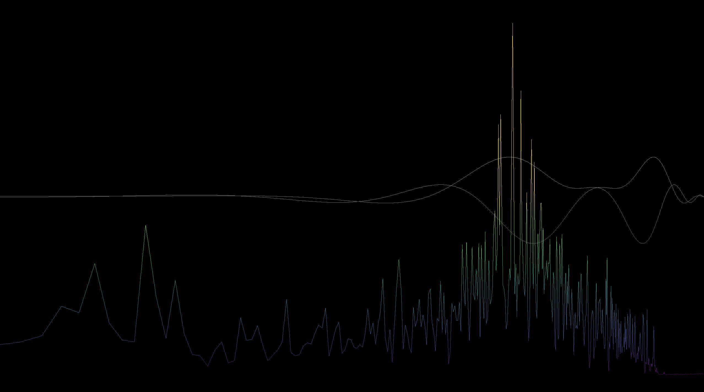

# Audio Visualizer
Andrew Wong  
Wong.816@osu.edu

## Usage

The program captures device audio output using the Windows Audio Session API (WASAPI) and visualizes the data using fft, b-spline, sub-sampling, and other processing techniques.
Press ESC to exit full screen, and 'F' to enter.
